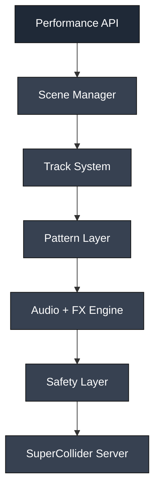

# SC StageKit

Live Coding Performance Framework for SuperCollider

## Overview

SC StageKit is a modular, performance-oriented framework for live coding and real-time musical improvisation in SuperCollider.

It provides a structured environment for building, controlling, and performing algorithmic music with:
 - deterministic timing
 - reusable abstractions
 - safe runtime behaviour
 - expressive live interaction

The framework bridges the gap between raw SuperCollider scripting and performance-ready systems.

## Goals

Primary Goals
 - Enable fast setup for live performance
 - Provide predictable timing and transitions
 - Reduce cognitive load during improvisation
 - Ensure audio safety and stability
 - Support MIDI and external control

Non-Goals
 -	Full DAW replacement
 -	GUI-first workflow
 -	Heavy abstraction that hides SuperCollider primitives

## System Architecture

The system is composed of loosely coupled modules:



## Core Components

### Engine

The Engine is responsible for global coordination.

Responsibilities:
 -	Tempo and clock management
 -	Quantisation
 -	Scheduling scene transitions
 -	Global state handling

Key Concepts:
 -	Single global TempoClock
 -	Bar-aligned execution
 -	Deterministic transitions

### Track System

Tracks represent independent musical layers.

Typical tracks:
 -	drums
 -	bass
 -	pad
 -	texture

Responsibilities:
 -	Pattern execution
 -	Synth routing
 -	Volume and mute control
 -	Parameter updates

Design Principles:
 -	Stateless patterns, stateful tracks
 -	Encapsulation of playback logic
 -	Independent routing via audio buses

### Scene Manager

The Scene Manager controls musical structure.

A Scene defines:
 -	Active tracks
 -	Pattern configurations
 -	Parameter states
 -	FX settings

Features:
	•	Quantised scene switching
	•	Glitch-free transitions
	•	Reproducible performance states

### Pattern Layer

Provides higher-level abstractions over raw Pbind.

Purpose:
 - Reusability
 -	Parameterisation
 -	Readability

Examples:
 -	Drum generators
 -	Bassline builders
 -	Texture generators

### Audio & FX Engine

Handles signal flow and processing.

Components:
 -	Track buses
 -	Master bus
 -	FX chains
 -	Send/return routing

Built-in effects:
 -	Reverb
 -	Delay
 -	Distortion
 - Sidechain (optional)

### Safety Layer

Ensures stable behaviour during live performance.

Features:
 -	Hard limiter on master output
 -	Gain clamping
 -	Emergency stop (panic)
 -	Resource cleanup

Design Goal:
Prevent runaway audio, clipping, and server instability.

### Control Layer (MIDI / OSC)

Enables external interaction.

Supported inputs:

 -	MIDI controllers
 -	OSC messages

Typical mappings:

 -	Faders → track volume
 -	Knobs → synth parameters
 -	Buttons → scene switching

## Data Flow

Scene → Track Configuration → Pattern → Synth → Bus → FX → Master → Output

Execution Flow
 1.	Scene is selected
 2.	Scene config updates tracks
 3.	Tracks trigger patterns
 4.	Patterns generate events
 5.	Events trigger synths
 6.	Audio flows through buses and FX
 7.	Output is processed by safety layer

## Runtime Behaviour

Scene Switching
 -	Quantised to bar boundaries
 -	Non-blocking
 -	Smooth transition (future: crossfade)

Parameter Updates
 -	Real-time
 -	Non-destructive
 -	Track-scoped or global

Failure Handling
 -	Panic function resets server state
 -	Limiter prevents audio spikes
 -	Graceful degradation under load

## Extensibility

The framework is designed for extension at multiple levels:

Extendable Areas
 -	New Track types
 -	Custom Pattern generators
 -	Additional FX modules
 -	Hardware integrations
 -	Custom control mappings

Plugin Opportunities
 -	Custom UGens
 -	DSP extensions
 -	External control bridges

## Repository Structure

```text
sc-stagekit/
├─ SCClassLibrary/
│  ├─ Engine.sc
│  ├─ Track.sc
│  ├─ Scene.sc
│  ├─ Pattern.sc
│  └─ Safety.sc
│
├─ Examples/
│  ├─ minimal.scd
│  ├─ techno.scd
│  └─ ambient.scd
│
├─ HelpSource/
├─ assets/
├─ tests/
├─ README.md
└─ sc-stagekit.quark
```

## Example Usage
### Example: Basic Live Performance Flow

```supercollider
// Start engine at 120 BPM
~engine.start(120);

// Load initial scene
~setScene.(\intro);

// Modify track parameters in real time
~tracks[\drums].set(\density, 0.6);

// Switch to next scene (quantised)
~setScene.(\drop);

// Emergency stop (kills all nodes)
~panic.();
```

## MVP Scope

Included
 -	Core engine with tempo and quantisation
 -	4 tracks (drums, bass, pad, texture)
 -	3 scenes (intro, build, drop)
 -	Basic FX chain
 -	Safety layer (limiter + panic)
 -	MIDI mapping (basic)

Excluded (future)
 -	GUI
 -	Advanced modulation system
 -	Preset persistence
 -	OSC remote control

## Future Roadmap

**V2**
 -	Smooth scene crossfading
 -	Macro controls
 -	Preset system

**V3**
 -	OSC integration
 -	Advanced generative modulation
 -	Plugin/UGen support

## Design Principles

 -	Performance-first: optimised for live use
 -	Predictability: deterministic timing and behaviour
 -	Minimalism: avoid unnecessary abstraction
 -	Safety: prevent audio/system failure
 -	Hackability: easy to modify and extend

## Target Users

 -	Live coders
 -	Electronic musicians
 -	Sound artists
 -	Creative coders
 -	Developers exploring audio systems
